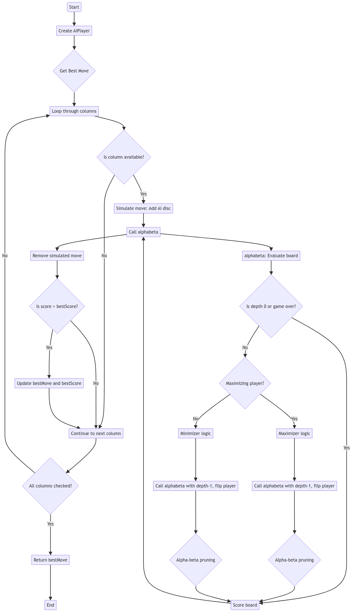

# Connect4Game

Connect4Game is a JavaFX-based implementation of the classic Connect 4 game. Players can compete against each other or play against an AI opponent. The game features a clean and interactive user interface.

---

## Features

- **Two-Player Mode**: Play with a friend locally.
- **Single-Player Mode**: Challenge an AI opponent with strategic gameplay.
- **Interactive UI**: Easy-to-use interface with buttons and visual feedback.
- **Winning Highlights**: Highlights the winning discs when a player wins.
- **Restart Option**: Quickly restart the game at any time.

---

## How to Run
- **You just need to run the .exe file and start playing**

## AI Player logic
